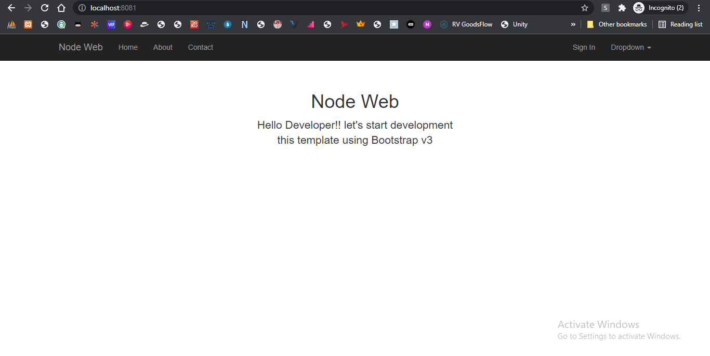

# NodeJs Web - Starter

<center></center>

<center>
	
	
</center>

## Overview

This is just my personal project to start web using nodejs

## View Engine

Default view engine using [Twing](https://nightlycommit.github.io/twing/intro.html) renamed as Twig on this application

## Database Support

> SQL database using driver from [Sequelize ORM](https://sequelize.org)

## Installation

```bash
npm install
```

### WebPack

```bash
cd client/source
```

```bash
npm install
```

---

### SQL Database Driver Installation

choose one of database driver will used

**MySQL**

```bash
npm run sequelize-mysql
````

**PostgreSQL**

```bash
npm run sequelize-postgre
````

**SQLite**

```bash
npm run sequelize-sqlite
````

---

### NoSQL Database Driver

**MongoDB**

```bash
npm run with-mongodb
```

**RethinkDB**

```bash
npm run with-rethinkdb
```

## Application Structure

- **app/** `Application folder`
	- **engines/**
	- **helpers/**
	- **libraries/**
	- **middlewares/**
	- **models/**
	- **routes/**
	- **sockets/**
	- **views/**
- **client/**
	- **public/**
		- **assets/** `Assets directory`
		- **uploads/** `Upload directory`
	- **source/** `Webpack build`
---

## Environment

| Environment | Description |
|-------------|-------------|
| **PORT** | Listen on port |
| **HOST** | Site hostname |
| **NODE_ENV** | Application envrionment : development, testing or production |
| **TIMEZONE** | Application timezone setting |
| **APP_NAME** | Application name |
| **APP_VERSION** | Application version |
| **APP_VENDOR** | Application vendor |
| **ENCRYPTION_KEY** | Encryption key |
| **DEVELOPER_MAIL** | Developer email |


| Environment | Description |
|-------------|-------------|
| **DB_ENABLE** | Enable database |
| **DB_ACTIVE** | Set default database group name |
| **DB_INIT** | Install tables on database |
| **DB_DROP** | Drop database on first start up |

---

## Language

> Language code using [ISO-639-2](https://www.loc.gov/standards/iso639-2)

| Code | English Name |
|------|--------------|
| **idn**  | Indonesian   |
| **eng**  | English   |

---
